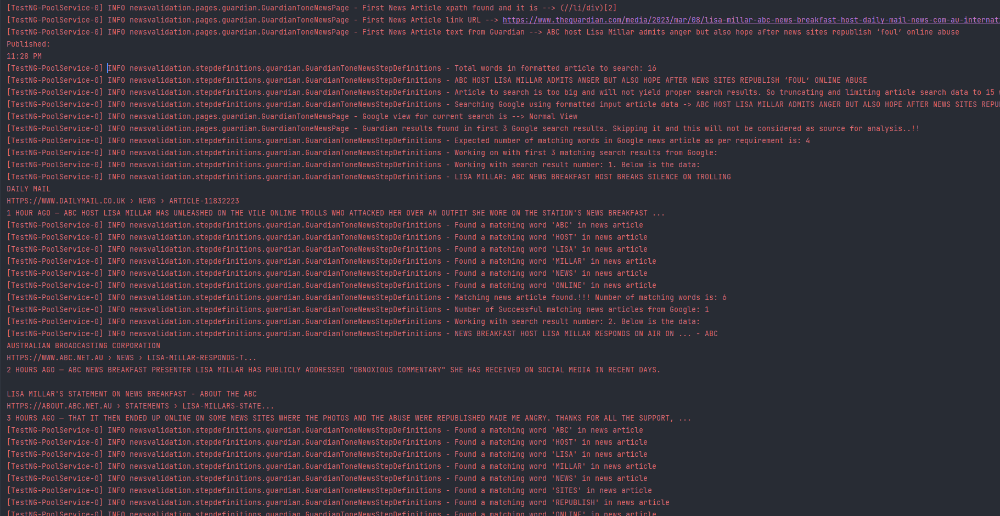
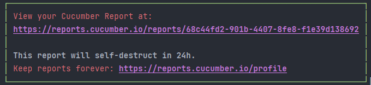
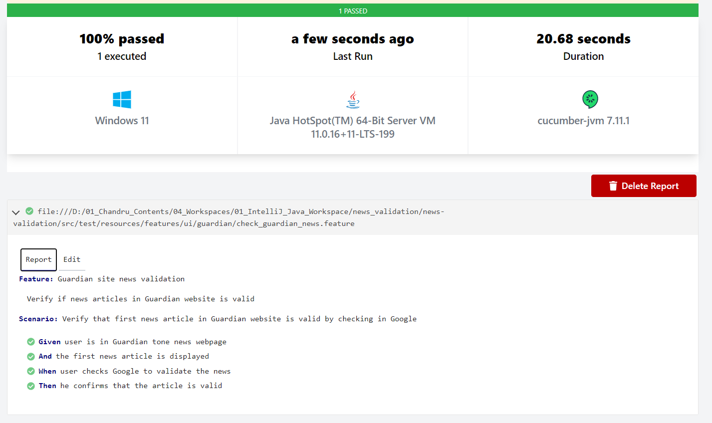
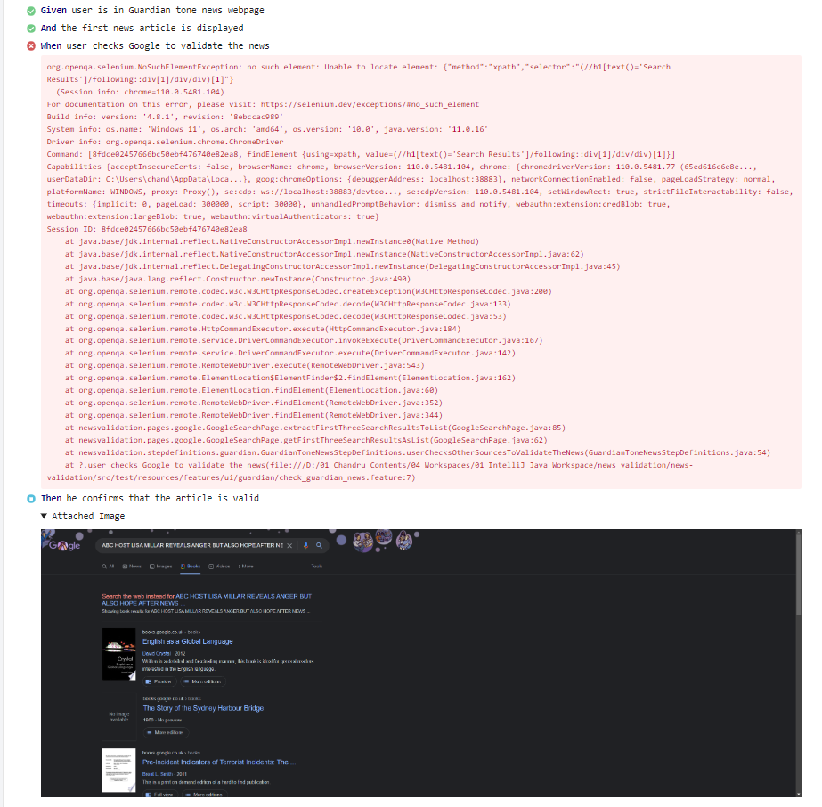

# Java, Selenium and Cucumber BDD test automation framework

Cucumber based BDD[Behavior-Driven Development] test automation framework using Page Object Model(POM) with support for web automation using Selenium.
Can be extended for Appium based mobile application automation as well. 

### Browsers supported:
-  1. Chrome 
-  2. FireFox
-  3. Edge
##### NOTE: Uses Selenium 4.8.1 which has Selenium manager to handle browsers no need to download/manage/configure driver executables.

### Setup required:
- Java 11
- IntelliJ or other supported IDE.
- GIT
- Maven - Dependency management
- Browsers to be installed: Chrome, FireFox and Edge.

Clone this repository to local machine and execute one time maven command 'mvn install' if required to download the dependencies.

### Applications/URL's tested:
- https://www.theguardian.com/tone/news
- https://www.google.co.uk/

### Folder and File Structure:

**src/test/java/newsvalidation** - Contains framework implementation, pages and step definitions:
*  ```src/test/java/newsvalidation/factory``` -> Driver and page object management.
* ```src/test/java/newsvalidation/pages``` -> Page file implementation.
* ```src/test/java/newsvalidation/runners``` -> Test runner path.
* ```src/test/java/newsvalidation/stepdefinitions``` -> Step definition implementation.
* ```src/test/java/newsvalidation/utilities``` -> Utilities folder containing data providers and support classes.

**src/test/resources** - Contains config and feature files:
*  ```src/test/resources/configFiles``` -> Config/property files containing framework configurations.
* ```src/test/resources/features``` -> Feature file location(Cucumber BDD test scenarios based on gherkin language).
* ```src/test/resources/cucumber.properties``` -> Cucumber configuration file.

**Other framework files**

* ```pom.xml``` -> Maven dependency configuration file.
* ```README.md``` -> Framework/project read me file.


### Test Execution of existing scenario:
**Scenario tested:** Launch Guardian tone news website and extract the details of first news article and search google to verify if the news is valid.
Assumptions made for story requirements like example number of words that should match.

**NOTE:** Applications used in the test script are external applications(Guardian and Google) which are tend to change and the complete UI requirements of these applications are unknown. If script fails, xpath or logic in handling them in page files needs to be changed.

Test execution happens by launching a browser based on the maven execution input, no additional configuration required.

**Maven command** to execute test scenario: `mvn test -Dbrowser=chrome`. 

NOTE: Change the browser name in the above command from chrome to firefox or edge as per requirement.


#### Test Output:
- Once execution starts you can see the browser being launched and test logs being captured in IDE terminal. Below screenshot of terminal logs for reference.


- Cucumber reporting is being used, reporting can be extended to other supporting reporting libraries as per requirement. 
- Once test execution is completed you will get the url for cucumber test report in the log. 
- Same report will be available in your target folder(target/report/html/) as well. When there is a test failure screenshot will be attached additionally to the test report.


- **Cucumber online report sample(Successful Test execution):**


- **Cucumber online report sample(Failed Test execution):**

